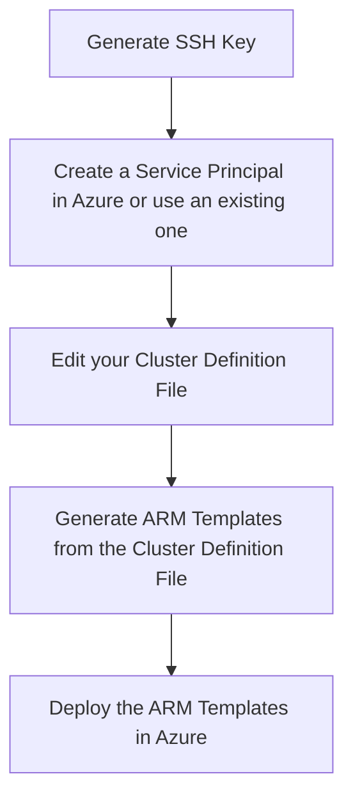

The article covers the basic structure of how Webhook Data from GitHub is passed to an Azure Automation Runbook and how it can be parsed using a sample Runbook included in this post.

# Overview

This article will cover the following:

* Basic structure of Webhook Data Payloads from GitHub.
* Sample Runbook showing how to parse Webhook Data Payloads triggered from GitHub.

The Name of the Service Principal and DNS Prefix for the documentation below is **azure-k8s-dev**.

## Prerequisites

* Access to an existing Azure Subscription with the rights to deploy and manage an Azure Automation Account.
* An existing GitHub Account.

## acs-engine Workflow

Below is a diagram of the order you should take to deploy a K8s Cluster using the acs-engine.



## Generate an SSH Key

Below is a quick way to generate an SSH Key using Bash.

```bash
ssh-keygen -t rsa -b 2048 -C "azure-k8s-dev-access-key" -f ~/.ssh/azure-k8s-dev-access-key -N ''
```

The acs-engine Cluster Definition Files are JSON files that allow you to configure several options about your K8s Cluster. Below are the primary options that you should probably be most aware of.

```text
orchestratorType     - Kubernetes
orchestratorVersion
masterProfile
agentPoolProfiles
linuxProfile
windowsProfile
servicePrincipalProfile
```

Several Cluster Definition File examples can be found in the **[ACS Engine GitHub Repository](https://github.com/Azure/acs-engine/tree/master/examples)**.

The acs-engine generates the following folder based off of the **DNS Prefix** that is defined in the **masterProfile** in the cluster-definition file. Shown below is what the folder structure would like if the DNS Prefix was called **azure-k8s-dev**.

```text
azure-k8s-dev --> apimodel.json
azure-k8s-dev --> apiserver.crt
azure-k8s-dev --> apiserver.key
azure-k8s-dev --> azuredeploy.json
azure-k8s-dev --> azuredeploy.parameters.json
azure-k8s-dev --> ca.crt
azure-k8s-dev --> ca.key
azure-k8s-dev --> client.crt
azure-k8s-dev --> client.key
azure-k8s-dev --> kubectlClient.crt
azure-k8s-dev --> kubectlClient.key
azure-k8s-dev --> kubeconfig
                  kubeconfig --> kubeconfig.australiaeast.json
                  kubeconfig --> kubeconfig.australiasoutheast.json
                  kubeconfig --> kubeconfig.brazilsouth.json
                  kubeconfig --> kubeconfig.canadacentral.json
                  kubeconfig --> kubeconfig.canadaeast.json
                  kubeconfig --> kubeconfig.centralindia.json
                  kubeconfig --> kubeconfig.centraluseuap.json
                  kubeconfig --> kubeconfig.centralus.json
                  kubeconfig --> kubeconfig.chinaeast.json
                  kubeconfig --> kubeconfig.chinanorth.json
                  kubeconfig --> kubeconfig.eastasia.json
                  kubeconfig --> kubeconfig.eastus2euap.json
                  kubeconfig --> kubeconfig.eastus2.json
                  kubeconfig --> kubeconfig.eastus.json
                  kubeconfig --> kubeconfig.germanycentral.json
                  kubeconfig --> kubeconfig.germanynortheast.json
                  kubeconfig --> kubeconfig.japaneast.json
                  kubeconfig --> kubeconfig.japanwest.json
                  kubeconfig --> kubeconfig.koreacentral.json
                  kubeconfig --> kubeconfig.koreasouth.json
                  kubeconfig --> kubeconfig.northcentralus.json
                  kubeconfig --> kubeconfig.northeurope.json
                  kubeconfig --> kubeconfig.southcentralus.json
                  kubeconfig --> kubeconfig.southeastasia.json
                  kubeconfig --> kubeconfig.southindia.json
                  kubeconfig --> kubeconfig.uksouth.json
                  kubeconfig --> kubeconfig.ukwest.json
                  kubeconfig --> kubeconfig.usgoviowa.json
                  kubeconfig --> kubeconfig.usgovvirginia.json
                  kubeconfig --> kubeconfig.westcentralus.json
                  kubeconfig --> kubeconfig.westeurope.json
                  kubeconfig --> kubeconfig.westindia.json
                  kubeconfig --> kubeconfig.westus2.json
                  kubeconfig --> kubeconfig.westus.json
```

## GitHub Webhook Payloads

GitHub Webhooks can be setup for a variety of different events that may take place against a specific organization or repository in GitHub. By default, webhooks are
subscribed to *push* events. Be aware that there a webhook will not be fired from GitHub if the payload is larger than 5 MB. Additional documentation about GitHub Webhooks
can be found in the *Additional Resources* section at the end of this article.

Below are two different Webhook Payloads from GitHub. The first examples is part of a from a Webhook that has just been created in GitHub. The second is from a Webhook Payload
from a Webhook that was triggered from a Repo Commit. Some value pairs have been removed from each example to keep the Some Values have been removed to keep the size of the sample small.
